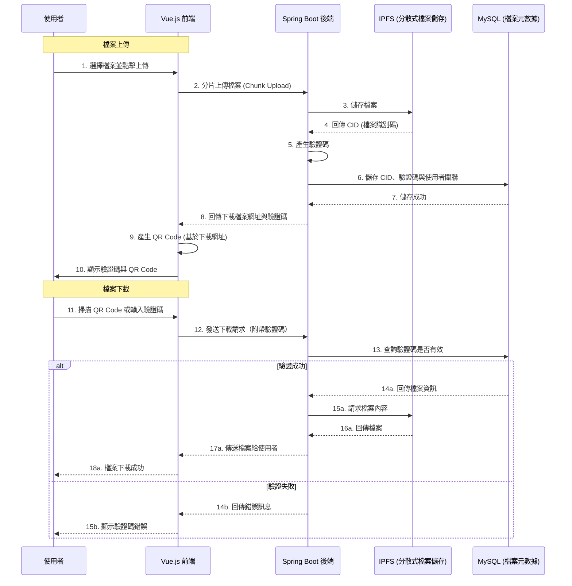
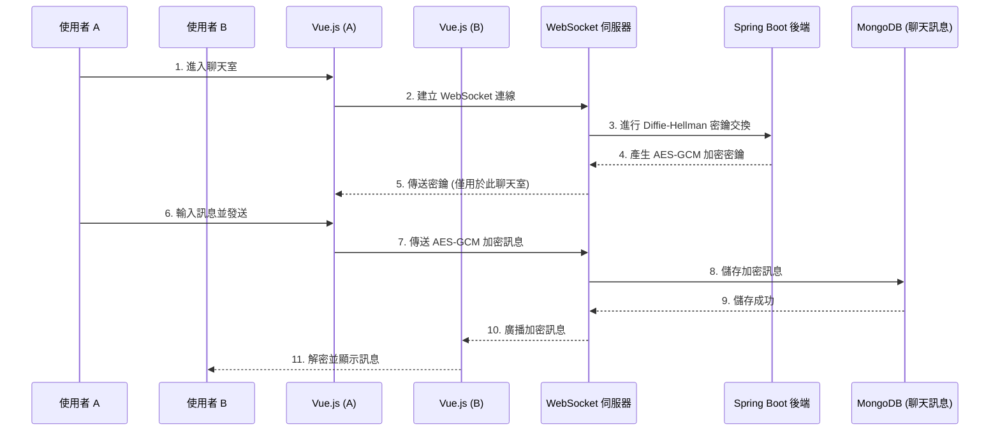
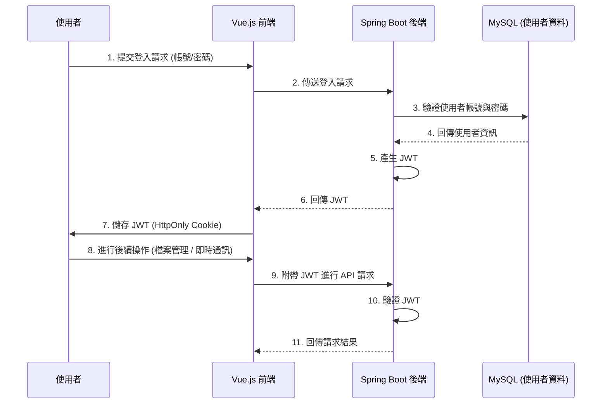

# SendEveryThing - 即時資訊分享

 

## 專案簡介
本專案為個人碩論[具機密性與身份認證之即時資訊分享：以 Vue.js 與 Spring 框架實作通訊協定與應用系統](https://hdl.handle.net/11296/m977gr)的前端實作部分。  
SendEveryThing 是一款整合 Vue.js + Spring Boot 的即時資訊分享平台，提供匿名檔案分享、即時通訊加密與多人檔案管理等功能，確保資訊安全與隱私。    

🔹 匿名檔案分享：無須註冊即可上傳與下載檔案與文字，並採用QR Code與驗證碼進行下載。  
🔹 即時聊天室：支援 AES-GCM 加密，確保訊息安全。  
🔹 多人檔案管理：註冊使用者可管理與分享檔案。  
🔹 安全驗證：採用 JWT + Spring Security + OAuth 2.0 (Google) 進行身份驗證。  

## 範例影片

[](https://youtu.be/sDwU72uj1Og)

## 專案流程
### 檔案管理模組


### 即時通訊模組


### 身分驗證模組 (Spring Security + JWT)


### 核心功能
🔹 **安全檔案分享**
- 私有 IPFS 集群架構
- 檔案節點複製備援
- 與外部網路隔離的安全傳輸
- 支援大檔案傳輸

🔹 **即時聊天室**
- 整合 WebSocket 技術實現即時通訊
- 採用 AES-GCM 加密確保訊息安全
- 支援多人群組聊天

🔹 **進階檔案管理**
- 檔案分類與標籤功能
- 支援檔案版本控制

🔹 **安全性設計**
- JWT + Spring Security 身份驗證
- OAuth 2.0 整合（Google 登入）
- 訊息加密保護

## 技術架構

### 前端 (Vue 3)
🔹 Vue 3 Composition API  
🔹 Pinia ( 狀態管理 )  
🔹 Vite ( 開發環境 )  
🔹 Web Worker ( 多執行緒處理 )  

### 後端 (Spring Boot)
🔹 Spring Boot 3  
🔹 Spring Security  
🔹 WebSocket ( 即時聊天 )  
🔹 JWT / OAuth 2.0 ( 身份驗證 )  

### 資料儲存
🔹 MySQL：集中式資料管理，儲存檔案元數據與使用者資訊  
🔹 MongoDB：聊天訊息儲存  
🔹 私有 IPFS 集群：
- 多節點互連架構
- 檔案複製備援機制
- 與外部 IPFS 網路隔離
- 優化的檔案傳輸效能

### DevOps & 部署
🔹 Nginx (反向代理)  
🔹 Docker (容器化)  
🔹 GitHub (版本控制)  

## 專案特色

### 安全性設計
- 私有 IPFS 網路隔離機制
- 檔案節點複製備援策略
- 全程 HTTPS 加密傳輸
- 完整的身份驗證機制

### 效能優化
- 私有 IPFS 集群優化傳輸效能
- 前端多執行緒處理大量運算
- 資料庫讀寫分離設計
- 快取機制優化響應時間

### 擴展性設計
- IPFS 節點可動態擴展
- 彈性的資料庫架構

## Recommended IDE Setup

[VSCode](https://code.visualstudio.com/)  
[Intellij](https://www.jetbrains.com/idea/)

## Project Setup

```sh
npm install
```

### Compile and Hot-Reload for Development

```sh
npm run dev
```

```sh
http://localhost:8081
```

### Compile and Minify

```sh
npm run build
```

```sh
services/Unify_API/API_URL.js
```
